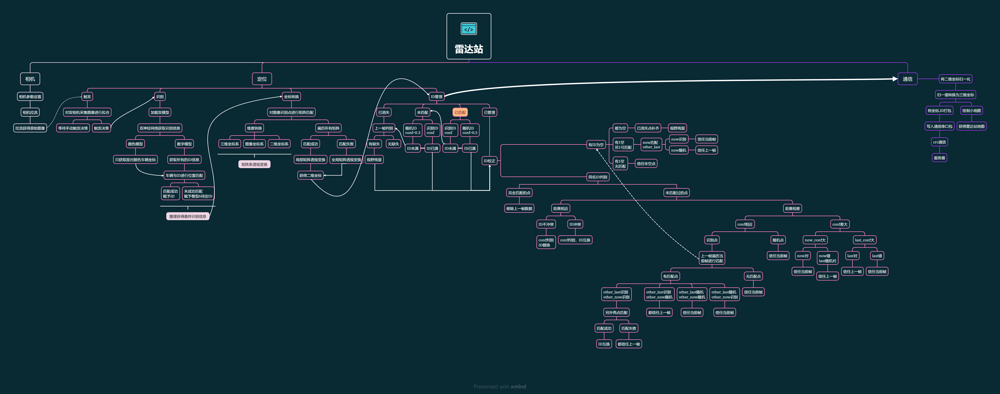

# Insight
> RoboMaster2023赛季 Evolution 视觉组**雷达站项目**代码

##**run**
**1.Before running the project, please review requirements. txt to confirm if your current environment meets the project's operational requirements
please complete the relevant project configuration in the profile**
> This project is not only suitable for this environment, it is only the environment used by the author. Users can adapt to the Cuda environment based on their graphics card, but the Python version cannot be 3.9 or more

**2.If your environment has already adapted to the project requirements, please check the configfile.py file, which is the configuration file for the project. Before running the project, please configure configfile.py according to your own needs**
>If you need a model, you can download it here
>
> [模型链接]https://github.com/zyradar/Models.git
 
`git clone https://github.com/zyradar/Models.git`

**3.If you have completed the above steps, you can directly run main.py**
> Then a black window will pop up. You need to select the window, press the N key under lowercase input, and an image will appear. You need to click on 4 matrix points on the image with the mouse to complete the entire project

###configfile
> This is a project configuration file. Before running the project, you need to select the running mode and configure the relevant configurations in that mode

###Location Matrix
The matrix was init in matrix.py

> If you want to change the positioning matrix of the radar station,you can modify the view function in the mouse.py 

> p_mouse is the matrix in the original diagram

The matrix parameters of this file are crucial modules in the project. Please refer to the file for details on matrix parameter settings and adjustments
> You can directly run this file to adjust the matrix parameters

## **Camera**
This module is the camera module in the project, which includes camera driver files, dependency files, and camera streaming programs
> Demo.py is a camera streaming file

You can adjust the parameters during camera streaming by modifying the project configuration file
> I have only written a few useful camera parameters here, and other camera parameters have not been customized. The camera pull does not turn on automatic exposure by default, and automatic white balance is turned on

## **Decision**
This is the decision-making module, which is the core part of the entire project
> maincamera.py and noserialcamera.py are the core threads of the two projects, maincamera.py is the communication mode, and noserialcamera.py file is the no communication mode. Both files can choose camera mode or video mode, and you can choose the mode you want in the project configuration file

> Mouse.py is a trigger mode for participating in partial decision-making

> Cameradetect.py is the core algorithm file with a lightweight

## **dll and include**
> Just system dependencies and driver files

## **Location** 
This module mainly consists of yolov7 model configuration files, Learn more about YOLOV7 on your own
> In addition, the module also includes necessary mini maps and other images for the project

## **Serial**
This is the communication module
> I am using the CRC communication method

Myserial.py is the communication thread throughout the entire project